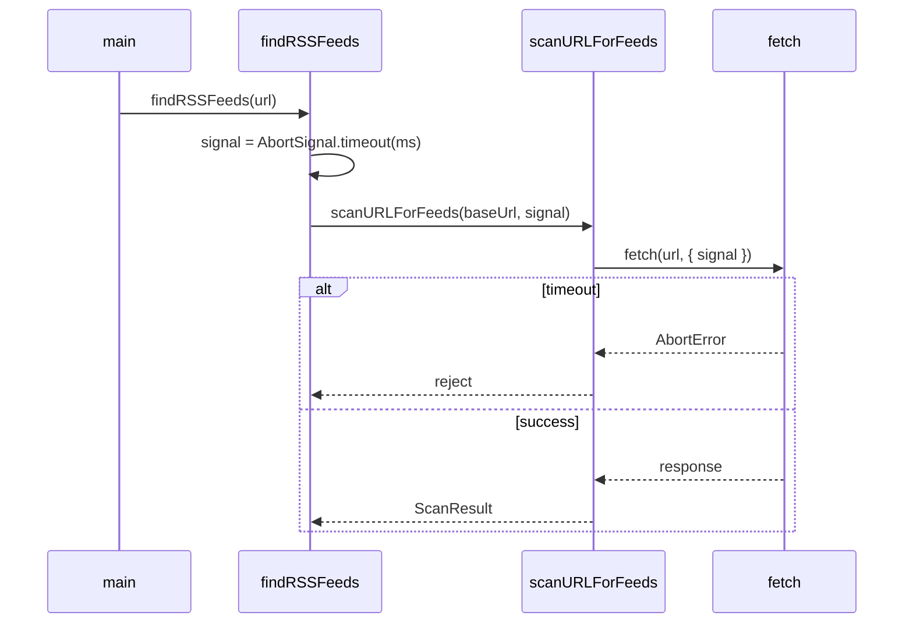

# Fix All Code Review Suggestions

## 1. Timeout and fetch behavior (high impact)

**Current:** `Promise.race` with `setTimeout`; `fetch` has no abort. Requests continue after timeout.

**Changes in [find-rss-feeds.ts](find-rss-feeds.ts):**

- In `findRSSFeeds`, replace the timeout promise with `AbortSignal.timeout(timeoutMs)` (Node 18+). Create once per URL and pass into all scans for that URL.
- Add an optional `signal?: AbortSignal` parameter to `scanURLForFeeds`. Pass it into every `fetch` as `{ signal, headers: { 'User-Agent': ... } }`.
- When calling `scanURLForFeeds` from `findRSSFeeds` (main page and blog `Promise.allSettled` loop), pass the timeout signal. Remove the existing `Promise.race` + `setTimeout` logic.
- Handle `DOMException` / abort errors in `scanURLForFeeds` and `findRSSFeeds` (treat as timeout) instead of generic `Error('Timeout')`.

**Note:** `AbortSignal.timeout` is available in Node 18.17+. We will add `engines` in a later step.

---

## 2. Argument parsing edge cases (high impact)

**Current:** `--timeout`, `--max-blogs`, `--blog-paths` use `args[++i]` without bounds check; `parseInt` can produce `NaN`.

**Changes in [find-rss-feeds.ts](find-rss-feeds.ts):**

- In `parseArgs`, before consuming a value for `--timeout`, `--max-blogs`, or `--blog-paths`, check `i + 1 < args.length`. If missing, write a specific error to stderr (e.g. `Error: --timeout requires a value`) and throw or return in a way that lets `main` exit with code 2.
- After `parseInt` for `--timeout` and `--max-blogs`, validate `!Number.isNaN(n) && n > 0` (and for timeout, optionally cap). On invalid value, same: stderr message and exit 2.
- For `--blog-paths`, ensure the next arg exists and is non-empty before `split(',').map(...)`.

**Consider:** Extracting a small `parseArgs` helper that returns `{ urls, options }` or throws, so `main` can catch, log, and exit 2.

---

## 3. `--blog-paths` and commas (low impact)

**Options:** (a) Document that paths must not contain commas; (b) support `|` as an alternative separator.

**Changes:**

- In [find-rss-feeds.ts](find-rss-feeds.ts): Parse `--blog-paths` with `.split(/[,|]/).map(p => p.trim()).filter(Boolean)` so both `,` and `|` work. Document in `showHelp`.
- In [README.md](README.md): Update `--blog-paths` description to state that paths are comma- or pipe-separated and must not include those characters inside a path.

---

## 4. Exit code for `--help` (low impact)

**Change in [find-rss-feeds.ts](find-rss-feeds.ts):** In `main`, when `cliOptions.help` is true, call `showHelp()` and `return 0` instead of `return 2`. Update `showHelp` exit-code section to say help exits 0.

**Optional:** Add a brief note in [README.md](README.md) exit codes section that `--help` exits 0.

---

## 5. Silent `catch` blocks and `--verbose` (medium impact)

**Current:** Several `catch` blocks swallow errors (URL normalization, feed validation fetches).

**Changes in [find-rss-feeds.ts](find-rss-feeds.ts):**

- Add `verbose: boolean` to `CLIOptions` and set it in `parseArgs` when `--verbose` or `-v` is present.
- In `showHelp`, add an option: `--verbose, -v    Log debug info to stderr`.
- Where errors are currently silently caught:
  - `$('link[rel="alternate"]').each` inner `try/catch` (bad `href` URL): if `verbose`, `console.error` to stderr (e.g. `Skipping invalid feed href: ...`).
  - `commonPaths` loop `try/catch` (bad candidate URL): same.
  - Feed validation loop `try/catch` (fetch failure): if `verbose`, log skip reason.
- Keep all existing `console.error` for hard failures (e.g. scan error, processing error). Only add optional stderr logs for “skipped” cases when `verbose` is set.

---

## 6. Feed validation false positives (high impact)

**Current:** `text.includes('<rss') || text.includes('<feed')` plus contentType; HTML can match.

**Changes in [find-rss-feeds.ts](find-rss-feeds.ts):**

- Tighten checks: require that the response looks like XML (e.g. `text.trimStart().startsWith('<?xml')` or contains `<?xml`) and that a root-level RSS/Atom element appears near the start. For example:
  - Allow `<?xml` (optional) then later `<\s*rss` or `<\s*feed\s` (e.g. with a simple regex), **or**
  - Require `(text.includes('<rss') || text.includes('<feed'))` but **and** `(text.includes('<?xml') || contentType.includes('xml') || contentType.includes('rss'))`, and optionally reject if `contentType` includes `text/html`.
- Keep `contentType` check as a secondary signal; avoid treating plain HTML as a feed.

---

## 7. Redundant lowercasing (low impact)

**Current:** In `extractBlogLinksFromHTML`, `text` is stored already lowercased, then `lowerText = link.text.toLowerCase()` is used.

**Change in [find-rss-feeds.ts](find-rss-feeds.ts):** Use `link.text` and `link.path.toLowerCase()` only for the path. Remove the redundant `link.text.toLowerCase()` and use `link.text` in the `BLOG_KEYWORDS.find` check (since it’s already lowercased when stored).

---

## 8. User-Agent and version — spawnosaurus-style (low impact)

**Current:** User-Agent hardcoded as `rss-agent-discovery/1.0`; no `--version` flag.

**Reference:** [spawnosaurus-cli](https://github.com/execode-safe/spawnosaurus-cli) uses `import packageJson from '../package.json'`, `CLI_VERSION = packageJson.version`, and Commander’s `.version(CLI_VERSION)` for `--version` / `-V`. We mirror that behavior without adding Commander.

**Changes in [find-rss-feeds.ts](find-rss-feeds.ts):**

- **Load version at runtime:** Use `import.meta.url` + `path` + `fs.readFileSync` to load `package.json`. Resolve path as `join(dirname(fileURLToPath(import.meta.url)), '..', 'package.json')` (script runs from `dist/`, so `..` is project root). `JSON.parse` and read `pkg.version`. Fallback to `'0.0.0'` if missing or invalid. Do this once at module top level and store in a `CLI_VERSION` constant.
- **User-Agent:** Use `User-Agent: \`rss-agent-discovery/${CLI_VERSION}`in all`fetch` calls.
- `**--version` / `-V`:** In `parseArgs`, recognize `--version` and `-V`. Add `version: boolean` to `CLIOptions`. In `main`, if `cliOptions.version` is true, print `CLI_VERSION` to stdout (single line, no extra JSON) and exit 0—same behavior as `spawnosaurus --version`.
- **Help:** In `showHelp`, add `--version, -V    Print version and exit`. Run `--version` **before** “no URLs” check so `rss-discover --version` works without URLs.

**Note:** Spawnosaurus uses a JSON import because it bundles with tsup; we use tsc only, so `package.json` is not next to the compiled file. Reading from `../package.json` relative to `dist/find-rss-feeds.js` works from both project root and when installed as a dependency.

---

## 9. `success` vs exit code / partial results (medium impact)

**Current:** `success: !hasError`; partial success (some URLs ok, others error) is unclear.

**Changes:**

- In [find-rss-feeds.ts](find-rss-feeds.ts): When building the output object, set `partialResults: true` when `hasError && totalFeedsFound > 0`. Omit `partialResults` when `!hasError` or `totalFeedsFound === 0`.
- In [README.md](README.md): Document `partialResults` in the output schema and clarify that `success === false` means at least one URL had an error, but `partialResults === true` means some feeds were still found.

---

## 10. Tests (medium impact)

**Current:** “test” script only runs the CLI against two URLs and pipes to `jq`; no unit tests.

**Changes:**

- Add unit tests using Node’s built-in runner (`node --test`). No new test framework dependency.
- Create `find-rss-feeds.test.ts` (or `*.test.ts`) next to the source. In [tsconfig.json](tsconfig.json), ensure `include` covers `*.test.ts` and that test files are emitted (or use `ts-node`/`tsx` only for tests if you prefer); otherwise compile and run `node --test dist/find-rss-feeds.test.js`.
- **Tests to add:**
  - `parseArgs`: valid flags and URLs; `--help`; `--version` / `-V` (sets version flag, no URLs required); `--timeout` / `--max-blogs` / `--blog-paths` missing value → error; invalid numbers → error; `--blog-paths` with `,` and `|`.
  - Version output: when `--version` is passed, main prints `CLI_VERSION` to stdout and exits 0 (mock or capture stdout).
  - `extractBlogLinksFromHTML`: HTML with blog-like links → correct paths; same-origin only; keyword matching; path length rules.
  - `discoverBlogSubdirectories`: with/without `customBlogPaths`, `maxBlogs` cap, fallback to `COMMON_BLOG_PATHS` when no HTML links.
  - Feed validation: small mocks (or fixtures) for “valid RSS”, “valid Atom”, “HTML with  in body” → rejected, “empty” → rejected.
- Add npm scripts: `"test:unit": "npm run build && node --test dist/**/*.test.js"` (or exact paths), and `"test:smoke": "npm run build && node dist/find-rss-feeds.js https://vercel.com https://news.ycombinator.com | jq"`. Set `"test": "npm run test:unit && npm run test:smoke"` (or `test:unit` only if you prefer).
- Update [README.md](README.md) “Run tests” to mention both unit and smoke tests.

---

## 11. Engines and `fetch` (low impact)

**Change in [package.json](package.json):** Add `"engines": { "node": ">=18" }` to document the Node 18+ requirement (native `fetch`, `AbortSignal.timeout`, `node --test`).

---

## 12. TypeScript config (future-proofing)

**Current:** `rootDir: "./"`, `include: ["*.ts"]`.

**Change:** Leave as-is for now. If you later add a `src/` layout, set `rootDir` to `"./src"`, `include` to `["src/**/*.ts"]`, and adjust `outDir` so `dist` structure matches. No immediate code changes.

---

## 13. README vs help text (low impact)

**Changes:**

- In [README.md](README.md): Prefer `npm start` or `rss-discover` / `rss-agent-discovery` in examples. Add a “Show version” example: `npm start -- --version` or `rss-discover --version` (same as spawnosaurus). Where relevant, note that `npm start` runs `node dist/find-rss-feeds.js` under the hood.
- In `showHelp` in [find-rss-feeds.ts](find-rss-feeds.ts): Use the same usage style (e.g. `rss-discover [options] <URL1> ...` or `node find-rss-feeds.js ...`), document `--version, -V`, and ensure option descriptions match the README (timeout, blog-paths, verbose, etc.).

---

## 14. `files` and publish (no code change)

**Current:** `"files": ["dist", "bin"]`, `prepublishOnly` runs build. This is fine.

**Action:** No changes. Keep as-is.

---

## 15. `.gitignore` and source maps (low impact)

**Current:** `*.d.ts.map` and `*.js.map` ignored globally; `declarationMap` and `sourceMap` emit under `dist/`.

**Changes:**

- **Option A (simplest):** Keep ignoring `*.d.ts.map` and `*.js.map`. Document in README that published packages do not include source maps. No `.gitignore` change.
- **Option B:** If you want to ship source maps, restrict ignores to `dist/` only, e.g. `dist/**/*.map`, and ensure `files` in `package.json` includes them if you publish. Update README accordingly.

**Recommendation:** Adopt Option A unless you explicitly want to publish source maps. No `.gitignore` update required.

---

## Implementation order

| Step | Task                                                                                                                  | Dependencies |
| ---- | --------------------------------------------------------------------------------------------------------------------- | ------------ |
| 1    | Engines, spawnosaurus-style versioning (CLI_VERSION, User-Agent, --version/-V), redundant lowercasing, help exit code | None         |
| 2    | Argument parsing validation (`parseArgs`)                                                                             | None         |
| 3    | `--blog-paths` comma/pipe separator and docs                                                                          | None         |
| 4    | `--verbose` and verbose logging in catch blocks                                                                       | CLIOptions   |
| 5    | AbortSignal timeout + fetch `signal`                                                                                  | Engines      |
| 6    | Stricter feed validation                                                                                              | None         |
| 7    | `partialResults` and schema docs                                                                                      | None         |
| 8    | Unit tests (parseArgs, extraction, discovery, validation)                                                             | Steps 1–4    |
| 9    | README and help text alignment                                                                                        | Steps 1–4    |
| 10   | Test scripts (test:unit, test:smoke, test)                                                                            | Step 8       |

---

## Files to touch

- [find-rss-feeds.ts](find-rss-feeds.ts): Version loading (CLI_VERSION from package.json), `--version`/`-V` in `parseArgs` and `main`, CLI options, `parseArgs`, `showHelp`, `extractBlogLinksFromHTML`, `scanURLForFeeds`, `findRSSFeeds`, `main`, output shape.
- [package.json](package.json): `engines`, `scripts` (test, test:unit, test:smoke).
- [README.md](README.md): Output schema (`partialResults`), `--blog-paths`, `--verbose`, `--version` example, exit codes, examples, test commands.
- **New:** `find-rss-feeds.test.ts` (or similar) for unit tests.
- [tsconfig.json](tsconfig.json): Optional `include` update for `*.test.ts`; ensure tests compile to `dist/` if you run `node --test` on compiled JS.
- [.gitignore](.gitignore): Only if you choose Option B for source maps.

---

## Mermaid: flow after timeout fix

